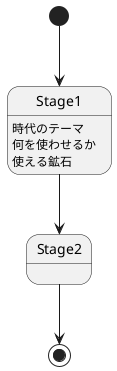

```plantuml
@startuml
[*] --> Stage1
Stage1: 時代のテーマ
Stage1: 何を使わせるか
Stage1: 使える鉱石

Stage1 --> Stage2
Stage2 --> [*]
@enduml
```

|Contents|Stage1|Stage2|
|--------|------|------|
|時代のテーマ|||
|鉱石|||
|主要Mod|||
||||