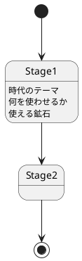

|Contents|Stage1|Stage2|Stage3|Stage4|Stage5|Stage6|Stage7|
|--------|------|------|------|------|------|------|------|
|時代のテーマ|石器時代？|青銅器|中世-近世|産業革命|現代工業|未来工業|Creative|
|鉱石|Coal|Copper, Tin, Lapis Lazuli|Iron, Zinc, Silver, Gold, Redstone, Emerald|Lead, Nickel, Diamond, Quartz|Aluminum, Uranium, Ancient Debris|Osmium||
|主要Mod|Roots Classic |Hexerei|Create Pretty Pipes Occultism|Immersive Engineering EvilCraft Elemental Craft Functional Storage|IC2 Classic|AE2 Mekanism Flux Networks||

制限
- 通常の鉱石生成なし、Geolosysベース
- 村人、放浪商人との取引なし